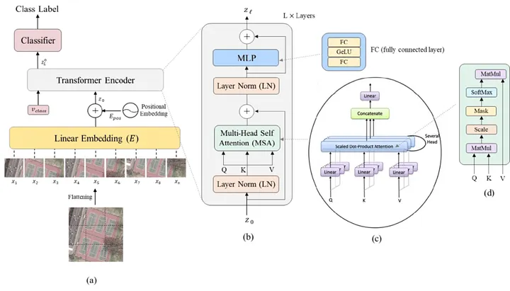
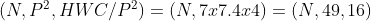

## [Project: Exploring Image Classification with Vision Transformers](https://git.ece.iastate.edu/jiztom/image-based-transformer)

**Note:** The link may not work for all if no prior access is given. Iowa State University students please reach out to 
author for access right.

### Objective:

This project aims to investigate the effectiveness of vision transformers (ViTs) for image classification tasks. Vision
transformers offer a promising alternative to traditional convolutional neural networks (CNNs) for image recognition by
leveraging self-attention mechanisms. We will explore the capabilities of ViTs and compare their performance with established CNN-based models on benchmark datasets.

### Methodology:

- Model Implementation:
  - Implement a ViT architecture (e.g., vanilla ViT, Swin Transformer) using a deep learning framework like PyTorch
  or TensorFlow.
  - Consider pre-trained ViT models available from repositories like timm or Hugging Face Transformers for transfer
  learning.
- Data Preparation:
  - Utilize a standard image classification dataset like CIFAR-10, CIFAR-100, or ImageNet.
  - Preprocess the data: resizing, normalization, data augmentation (optional).
- Training:
  - Train the ViT model on the chosen dataset, monitoring training and validation losses/accuracy.
  - Experiment with hyper-parameter tuning (learning rate, batch size, optimizer) to optimize performance.
- Evaluation:
  - Evaluate the trained ViT model on a held-out test set.
  - Compare the achieved accuracy with benchmark results of established CNN models (e.g., ResNet, VGG).
  - Analyze the model's performance on different image categories (if applicable).
- Visualization (Optional):
  - Explore techniques like Grad-CAM to visualize the attention maps and understand which image regions the model
  focuses on for classification.

### Deliverables:
- Documented code for the implemented ViT model and training pipeline.
- Trained model weights and performance metrics (accuracy, loss curves) on the test set.
- A report summarizing the project's methodology, results, and comparison with CNN baselines. (Optional:
Visualization of attention maps)

### Expected Outcomes:
- Gain practical experience implementing and training a vision transformer model.
- Evaluate the effectiveness of ViTs for image classification compared to traditional CNNs.
- Understand the strengths and limitations of ViTs and identify areas for potential further exploration.
- Contribute to the growing research and development of transformer-based approaches in computer vision.

### Potential Extensions:

- Explore variations of ViT architectures (e.g., Swin Transformer, DeiT).
- Investigate fine-tuning pre-trained ViT models on specific image classification tasks.
- Implement self-distillation techniques for improving ViT performance and reducing computational cost.
- Extend the project to explore object detection or image segmentation tasks using ViT-based architectures.

This project provides a foundation for exploring the exciting world of vision transformers and their potential in image
classification. By completing this project, you will gain valuable experience in implementing deep learning models, working with image
datasets, and evaluating model performance.

### Creating Vision Transformer from Scratch
One of the state-of-the-art models which have a high performance and inbuilt explainers for such models.
We will be working on creating a Vision Transformer from Scratch and then work on customizing the model to work with the
custom dataset. The paper Bazi et al. for reference can be found 
[here](https://www.researchgate.net/publication/348947034_Vision_Transformers_for_Remote_Sensing_Image_Classification)

|                                                                                                                                                                                                                                |
|:---------------------------------------------------------------------------------------------------------------------------------------------------------------------------------------------------------------------------------------------------------------------------------:|
| **Fig 1.** The architecture of the ViT with specific details on the transformer encoder and the MSA block. Keep this picture in mind. Picture from [Bazi et. al.](https://www.researchgate.net/publication/348947034_Vision_Transformers_for_Remote_Sensing_Image_Classification) |

#### Dataset
We will start by trying to work with MNIST Data set by [LeCun et al.](http://yann.lecun.com/exdb/mnist/)
handwritten digits where each of them are 28x28 binary pixels

## Implementation
gitlab code: [Image based transformer](https://git.ece.iastate.edu/jiztom/image-based-transformer)

### Image Preprocessing and Transformer Encoder

Figure 1 illustrates the initial processing stage. The input image is divided into equally sized **sub-images** (patches) through a process called patchification. This segmentation allows the model to analyze smaller, localized features within the image.

Each sub-image is then processed through a **linear embedding layer**. This operation transforms the high-dimensional pixel values of the patch into a lower-dimensional vector representation suitable for further processing by the transformer.

To understand the relative positions of these sub-images within the original image, a **positional encoding** step is crucial. This injects additional information into each vector, indicating its original location in the image grid. Without this positional information, the model wouldn't be able to capture the spatial relationships between different parts of the image, leading to potentially inaccurate predictions.

These processed sub-image vectors, along with a special **classification token**, are then fed into a series of **stacked transformer encoder blocks**. Each encoder block consists of the following components:

* **Layer normalization (LN):** This step normalizes the activations of the previous layer, improving training stability and gradient flow.
* **Multi-head self-attention (MSA):** This core component allows the model to attend to relevant parts of other sub-image vectors within the sequence. It essentially enables the model to "look" at other patches and understand how they relate to the current patch, capturing long-range dependencies within the image.
* **Residual connection:** This connection adds the input of the block to its output, facilitating faster learning and preventing vanishing gradients.
* **Second layer normalization (LN):** Applied after the multi-layer perceptron (MLP) for similar reasons as the first LN.
* **Multi-layer perceptron (MLP):** This component introduces non-linearity into the model, allowing it to learn more complex relationships between features.
* **Residual connection:** Again, this connection helps with gradient flow and learning.

These encoder blocks are stacked sequentially, allowing the model to progressively refine its understanding of the image by attending to both local and global features.

Finally, a separate **classification MLP block** operates only on the special classification token. Since this token has "seen" all the sub-images through the encoder, it effectively captures global information about the entire image. The output of this final MLP provides the model's prediction for the image classification task.

This explanation clarifies the purpose of each step and emphasizes the importance of positional encoding for understanding spatial relationships in images. It also breaks down the functionality of the transformer encoder block and its subcomponents.

### Building ViT from scratch

1. **Patchifying and linear mapping**:
   The transformer encoder was developed with a sequence data in mind such as English sentences. We can do this by reshaping 
   the input of say size in this context (N,C,H,W) for MNIST example (N,1,28,28) to size (N, #patches, Path dimension).
   The patch dimension is adjusted according to needs. 

  In this example we are splitting it into 7x7 patches so each of the sub image is 4x4 image. thereby getting a 7x7=49 sub images
  from a single input. 

  

2. ** second** 